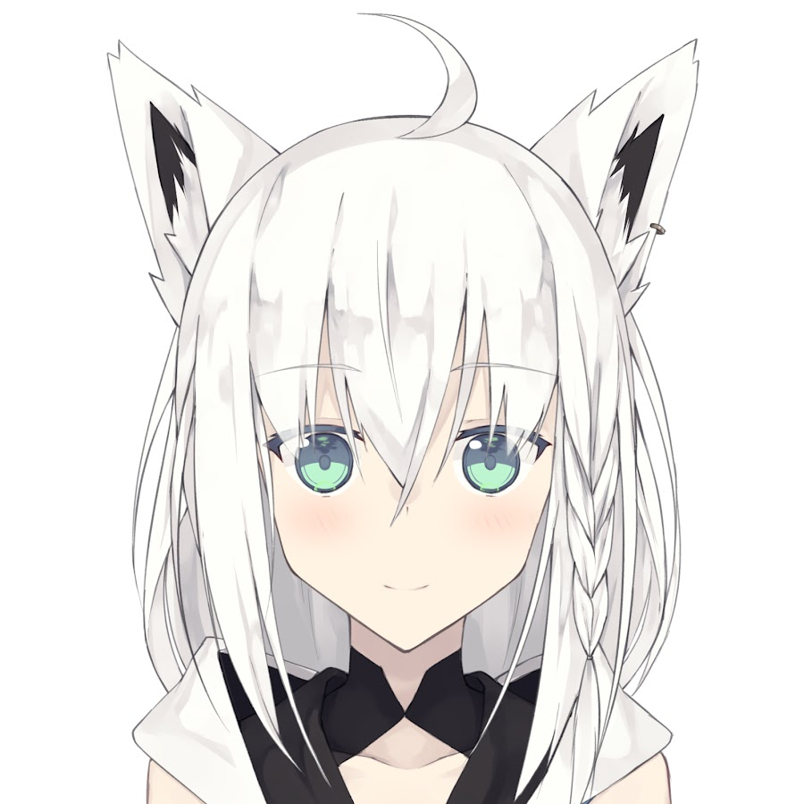
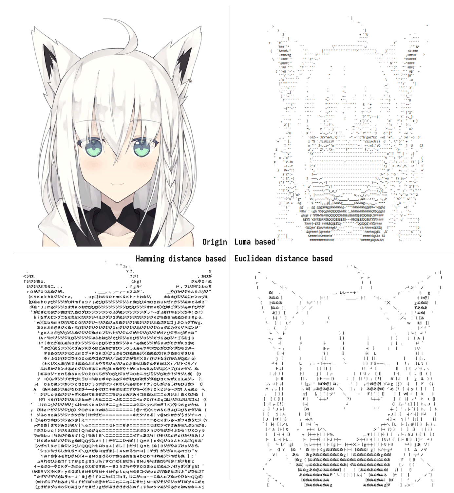

# Charalize

Charalize images

## Introduction

Using block routine (*class* `Blockways`) or pixel routine (*class* `Pixelways`) to convert your images to texts 😆

## Algorithm

Here is a tagert image where a lovely 🐱 (cat) inside, and we want to convert it.

### 1. `Pixelways` a luma based algorithm

It is an intuitive algorithm, and pertty effective either.
It, however,
has a great flaw which will be seen in a relatively bigger font size.
Here is an example (Using `NotoSansCJK-Regular.ttc`, font size is 12, spacing is 3)

[Converted Text Here](./transform_luma_based.txt)

### 2. `Blockways` along with Euclidean distance metric

In luma based algorithm, a character is been thumbnailed into 1 by 1 piexl, and get its luma comparing with thumbnailed origin image to get a suitable character.

This would not be accurate when a character is too big, as single luma value cannot correctly indicate the most suitable replacement.

So we need to compare each block pixel by pixel. We can vectorize that block, and calculate the vector distance.

Here we go (Using `NotoSansCJK-Regular.ttc`, font size is 12, spacing is 3)

[Converted Text Here](./transform_euclidean_distance_based.txt)

### 3. `Blockways` along with cosine distance metric

Comparing with euclidean distance, cosine distance seems to be sensitive at edges in
that image.

Let's take a look on it (Using `NotoSansCJK-Regular.ttc`, font size is 12, spacing is 3)

[Converted Text Here](./transform_cosine_distance_based.txt)

### 4. `Blockways` and Hamming distance metric

Well, I find one vector distance algorithm used to calculating the distance between texts that applying it here is interesting.

[Converted Text Here](./transform_hamming_distance_based.txt)

## Overview

At the end, let's take a comparsion of these algorithm above.

Well, all algorithms above seem losing the charming smile of that cat.

☹🔫

