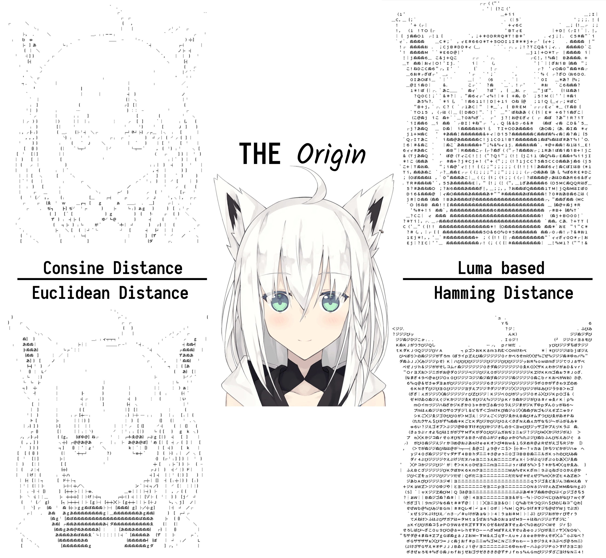

# Charalize

Charalize images

## Introduction

For now, it is under a very early development period.

## Algorithm

Here is a tagert image where a lovely cat inside, and we want to convert.

### 1. *legency* Luma based algorithm

It is an intuitive algorithm, and pertty effective either.
It, however,
has a great flaw which will be seen in a relatively bigger font size.
Here is an example (Using `consola.ttf`, font size is 12, spacing is 5)

[Converted Text Here](./transform_luma_based.txt)

### 2. Euclidean distance algorithm

In legency luma based algorithm, a character is been thumbnailed into 1 by 1 piexl, and get its luma comparing with thumbnailed origin image to get a suitable character.

This will failed when a character is too big for that single luma value cannot correctly indicate the most suitable replacement.

So we need compare each block pixel by pixel. We can vectorize that block, and calculate the vector distance.

Here we go (Using `NotoSansCJK-Regular.ttc`, font size is 12, spacing is 3)

[Converted Text Here](./transform_euclidean_distance_based.txt)

### 3. Hamming distance algorithm

Well, I find one vector distance algorithm used to calculating the distance between texts that applying it here is interesting.

[Converted Text Here](./transform_hamming_distance_based.txt)

### Overview

At the end, let's take a comparsion of these algorithm above

